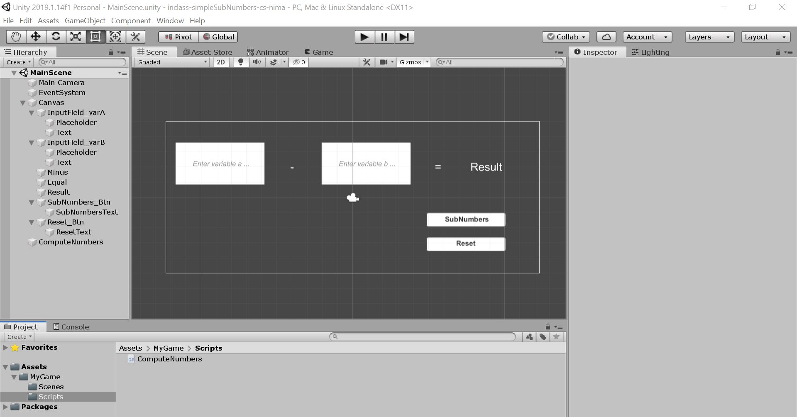

# inclass-simpleSubNumbers-cs-nima

### Project description: 

* Introduction/Project summary 
* Create GitHub repository and clone it locally
* Copy in Unity 2019
* Build a GUI
* Script for input fields and buttons

### Development platform: 
* Unity 2019.1.14.f1
* Visual Studio Community 2019

### Target platform: 
* WebGL (Resolution 1920 x 780)

### Third party material: 
* Template from 3ahmnm-htlsbg/Unity2019114f1-2D-Template 

### Screenshots:

### Lessons Learned: 
* Creating GUI with Input Fields and Buttons
* Create own Ref Resolution in Unity
* Create Script for input fields
* Create SubNumbers Button Script 
* Create Reset Button

Copyright by nima